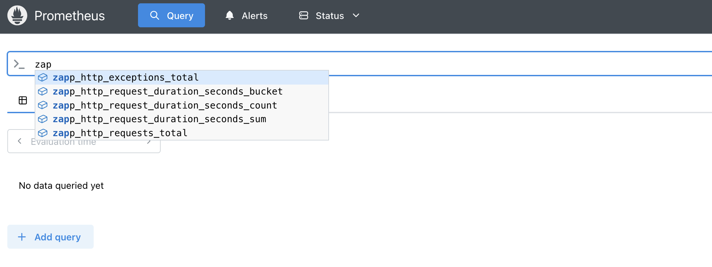
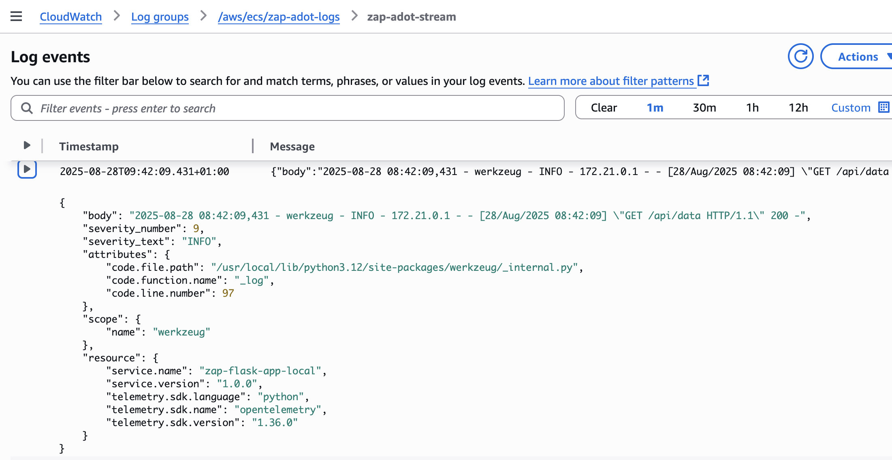
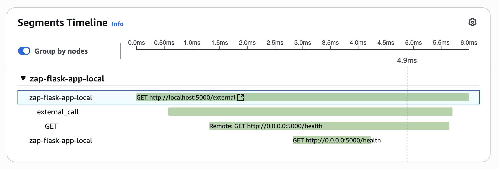
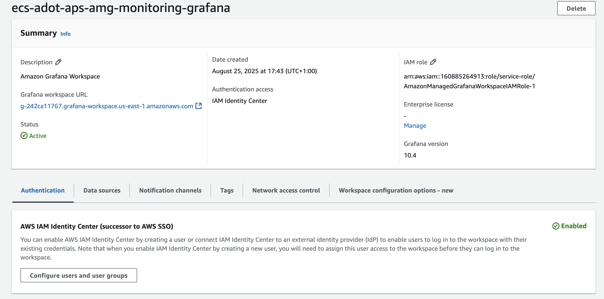
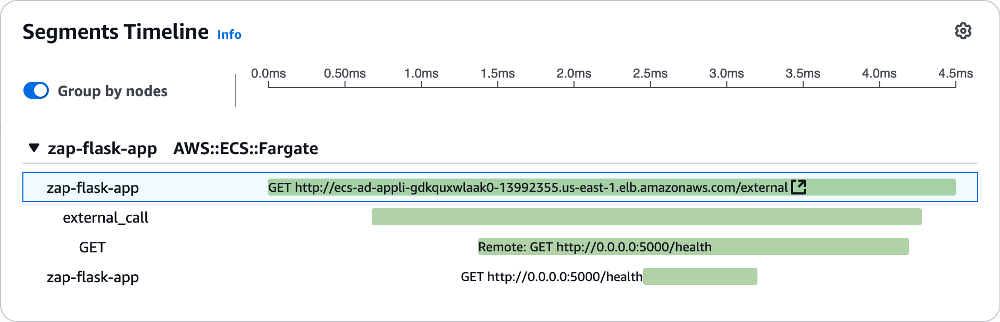
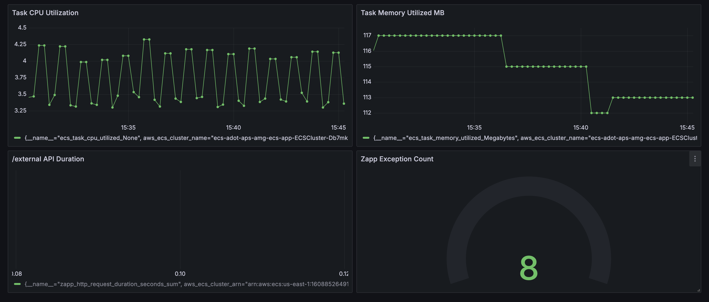
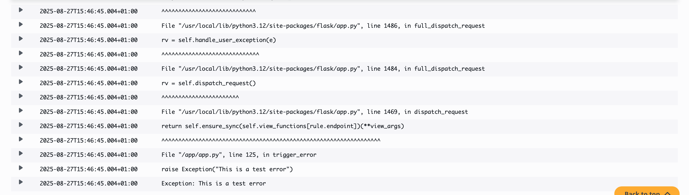

# ECS ADOT Prometheus Grafana

A complete observability solution using [AWS Distro for OpenTelemetry (ADOT)](https://aws-otel.github.io/), [Amazon Managed Service for Prometheus (AMP)](https://aws.amazon.com/prometheus/), and [Amazon Managed Grafana (AMG)](https://aws.amazon.com/grafana/) with [ECS Fargate](https://docs.aws.amazon.com/AmazonECS/latest/developerguide/AWS_Fargate.html).

## Architecture

This project demonstrates:
- **Local testing** - using Docker compose, ADOT collector to ship logs, traces and metrics to Amazon CloudWatch Logs, AWS X-Ray and Prometheus container instance respectively.

- **AWS deployment** - Deployment to AWS that covers using ADOT side car pattern along with your application in an ECS Fargate task. The ADOT side car pushes the received metrics to an Amazon Managed Service for Prometheus workspace and they are further visualized using Amazon Managed Grafana instance. The traces are shipped to AWS X-Ray whereas application and ADOT side car logs are pushed to Amazon CloudWatch Logs with the help of ECS native log driver - awslogs.

## Project Structure

```
├── local/                   # Local development environment
│   ├── docker-compose.yml   # Multi-container setup
│   ├── adot-config.yaml     # ADOT Collector configuration
│   └── prometheus.yml       # Prometheus configuration
├── cloudformation/          # AWS infrastructure templates
│   ├── 0-vpc-alb-template.yaml      # VPC and ALB stack
│   ├── 1-monitoring-template.yaml   # AMP and AMG stack
│   ├── 2-ecs-fargate-template.yaml  # ECS application stack
│   └── deploy-0-1-2.sh              # Deployment script
└── zap-app/                # Sample Flask application
    ├── app.py              # OpenTelemetry instrumented app
    ├── build-image.sh      # Build application image
    ├── requirements.txt    # Dependecies
    └── Dockerfile          # Container definition
```

## Application endpoints
The Flask application exposes the following endpoints:

- `/health`   - Health check
- `/api/data` - Sample data endpoint
- `/external` - External service call
- `/error`    - Error simulation

## Local Environment

### Services
- **zap-app**: Flask application with OpenTelemetry instrumentation.
- **adot-collector**: ADOT Collector for telemetry processing.
- **prometheus**: Local Prometheus container instance with remote write enabled for metrics storage.
- **AWS X-Ray**: ADOT Collector to push traces to X-Ray using `awsxray` exporter.
- **Amazon CloudWatch Logs**: ADOT Collector to push logs to CloudWatch using `awscloudwatchlogs` exporter.

### Prerequisites and Configuration

Please ensure that the following are configured
   - Docker and Docker Compose
   - AWS IAM user credentials to allow ADOT collector to push logs to Amazon CloudWatch and traces to AWS X-Ray.
   
```json
   {
    "Version": "2012-10-17",
    "Statement": [
        {
            "Sid": "sid-1",        
            "Effect": "Allow",
            "Action": [
                "logs:CreateLogGroup",
                "logs:CreateLogStream",
                "logs:DescribeLogGroups",
                "logs:DescribeLogStreams",
                "logs:PutLogEvents",
                "logs:GetLogEvents",
                "logs:FilterLogEvents"
            ],
            "Resource": "*"
        },
        {
            "Sid": "sid-2",
            "Effect": "Allow",
            "Action": [
                "xray:PutTraceSegments",
                "xray:PutTelemetryRecords",
                "xray:GetSamplingRules",
                "xray:GetSamplingTargets",
                "xray:GetSamplingStatisticSummaries"
            ],
            "Resource": [
                "*"
            ]
        }
        ]
    }
   ```

Update `local/adot-config.yaml` the environment variable with the relevant region and AWS credentials and Prometheus endpoint -
```
    AWS_REGION=us-east-1
    AWS_ACCESS_KEY_ID=${AWS_ACCESS_KEY_ID}
    AWS_SECRET_ACCESS_KEY=${AWS_SECRET_ACCESS_KEY}
    AWS_PROMETHEUS_ENDPOINT=http://prometheus:9090/api/v1/write
```

### Run locally
   ```bash
   cd local
   docker-compose up --build
   ```

### Access services
Flask App: http://localhost:5000/

Observe the following telmetry data:
- metrics - using Prometheus UI: http://localhost:9090/



- logs - accessing the CloudWatch loggroup specified in adot-config file: `/aws/ecs/zap-adot-logs`



- traces - accessing the AWS X-Ray traces from AWS Console.




## AWS Deployment

For complete deployment of the stack, use the following command:
   ```bash
   ./deploy-0-1-2.sh
   ```   

The script uses 3 CloudFormation templates:

### Template 0: VPC and ALB
Creates networking infrastructure with VPC endpoints the following services:
```
com.amazonaws.${AWS::Region}.ecr.dkr - ECR Docker Registry
com.amazonaws.${AWS::Region}.ecr.api - ECR API
com.amazonaws.${AWS::Region}.aps - Amazon Managed Service for Prometheus
com.amazonaws.${AWS::Region}.aps-workspaces - Amazon Managed Service for Prometheus Workspaces
com.amazonaws.${AWS::Region}.xray - AWS X-Ray
com.amazonaws.${AWS::Region}.logs - CloudWatch Logs
com.amazonaws.${AWS::Region}.s3 - Amazon S3
```
These VPC endpoints enable secure, private communication between ECS tasks and AWS services without requiring internet access, supporting the observability stack's requirements for container registry access, metrics collection, distributed tracing, and log aggregation.

### Template 1: Monitoring
Sets up Amazon Managed Prometheus and Grafana workspaces.

Please ensure that after successful deployment of this stack, you have enabled IAM Identity Center and added a user with Admin priviledge. This will allow the user to add Data Source to the AMG instance and will allow them to create dashboards.



### Template 2: ECS Fargate
Deploys the containerized application with ADOT sidecar in an ECS Fargate cluster.
In task definition, you will find that the environment variable `AWS_PROMETHEUS_ENDPOINT` which needs to be populated with the value of the AMP remote write URL endpoint. This will ensure the ADOT collector sidecar to push the collected metrics to the created AMP endpoint.

### Deployment Parameters
- `stack-prefix`: Prefix for all CloudFormation stacks (default: ecs-adot-amp-amg)
- `region`: AWS region (default: us-east-1)

## Application Endpoints
Try accessing the application over the ALB endpoint appending the following endpoints- 

```
http://LoadBalancerURL/health
```

Replace `LoadBalancerURL` with the url of the ALB created in the infrastructure stack. Try accessing the other endpoints exposed by your Flask application.

## Observability Features

You will observe the telemetry data -

- **Traces**: Distributed tracing via AWS X-Ray



- **Metrics**: Custom application metrics to AMP



- **Logs**: Application logs to CloudWatch



## Cleanup

```bash
# Delete CloudFormation stacks
aws cloudformation delete-stack --stack-name ecs-adot-amp-amg-ecs-app
aws cloudformation delete-stack --stack-name ecs-adot-amp-amg-monitoring  
aws cloudformation delete-stack --stack-name ecs-adot-amp-amg-vpc-alb
```